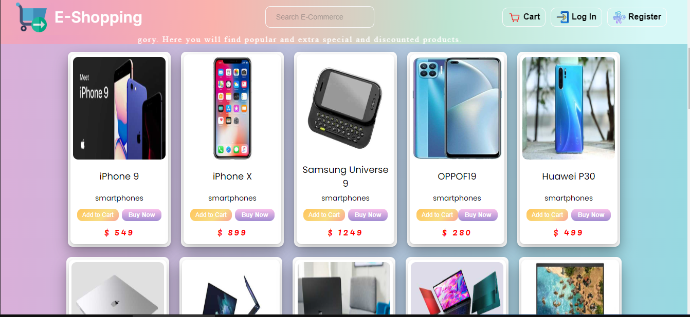

# JS-Project-6- E Shopping

##JS eğitiminde hazırlanmış projedir.

# "E-Shopping" HTML-CCS-JS -Api yapı ile oluşturulmuştur.

### udemig ödev çalışmasıdır...

# E-Shopping

Veritabanında Verileri alıp ekrana yansıtan
ve temel sepet işlevlerine sahip olan e-shopping projesidir.

## Kaynaklar

- API: https://dummyjson.com/
- Temel Url: https://dummyjson.com/products
- Temel Url (2): https://dummyjson.com/products/categories

## İçeriği

- Statik bir header

- API'dan kategori ve ürünler alınıp ve ekrana yansıtıldı

- Sepet modalı sepete ekle ile aktif edildi
- - yeni bir pencere ile gösterildi
- - içerisindeki butonuna tıklanınca kapananan
- - atı ve eksi yönlerle miktar ve fiyat bilgisi güncellenen 
- - ödeme ekranına tutarla birlikte geçişi sağlanan bir yapıda oluşturuldu

- login butonuna tıklanıldığında login modal sayfası ekrana yansıtıldı
- register butonuna tıklanıldığında login modal sayfası ekrana yansıtıldı

## Preview

# E-Shopping-JsProject-6
